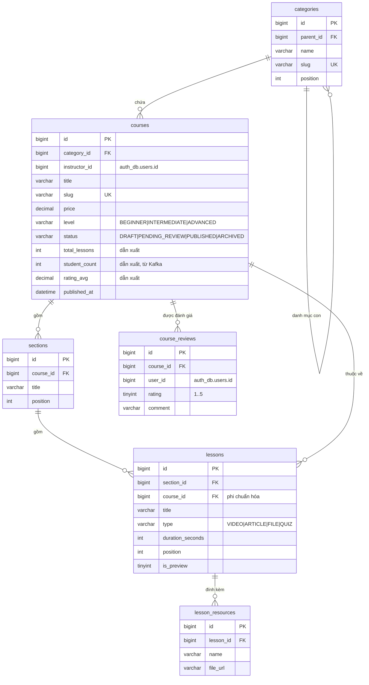
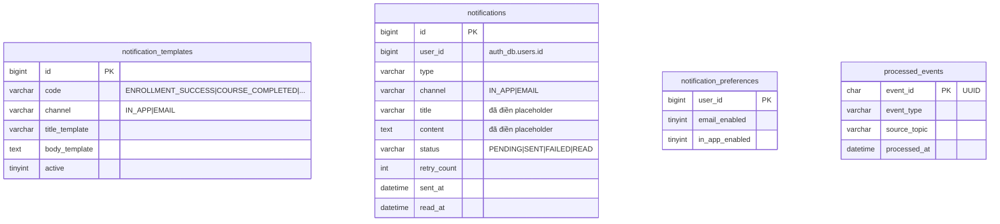

# Thiết kế cơ sở dữ liệu

Tài liệu mô tả thiết kế database của hệ thống E-Learning Microservices: quy ước chung,
sơ đồ quan hệ từng service và lý do đằng sau các quyết định đáng chú ý.

- [Nguyên tắc chung](#nguyên-tắc-chung)
- [Quy ước đặt tên và kiểu dữ liệu](#quy-ước-đặt-tên-và-kiểu-dữ-liệu)
- [Tham chiếu xuyên service](#tham-chiếu-xuyên-service)
- [auth_db - auth-service](#auth_db---auth-service)
- [course_db - course-service](#course_db---course-service)
- [enrollment_db - enrollment-service](#enrollment_db---enrollment-service)
- [quiz_db - quiz-service](#quiz_db---quiz-service)
- [notification_db - notification-service](#notification_db---notification-service)
- [Các quyết định thiết kế đáng chú ý](#các-quyết-định-thiết-kế-đáng-chú-ý)
- [Áp dụng schema](#áp-dụng-schema)

## Nguyên tắc chung

1. **Database per service.** Mỗi service sở hữu đúng một database. Không service nào
   đọc hay ghi trực tiếp database của service khác, kể cả khi chúng cùng nằm trên một
   instance MySQL. Muốn lấy dữ liệu của service khác thì gọi API hoặc nghe sự kiện Kafka.
2. **Không có khóa ngoại xuyên database.** Trong cùng một database vẫn dùng `FOREIGN KEY`
   bình thường. Liên kết sang service khác chỉ lưu giá trị id kèm index, không ràng buộc.
   Lý do: hai database có thể tách sang hai máy chủ khác nhau bất cứ lúc nào, và ràng
   buộc cứng giữa chúng sẽ biến hệ thống thành một khối gắn chặt.
3. **Tính toàn vẹn xuyên service do tầng ứng dụng lo**, không do database. Ví dụ
   enrollment-service phải tự kiểm tra khóa học có tồn tại và đã `PUBLISHED` hay chưa
   trước khi cho ghi danh.
4. **Nhất quán cuối (eventual consistency)** giữa các service, thông qua Kafka. Dữ liệu
   nhân bản (như `course_snapshots`) chấp nhận trễ vài giây so với nguồn.
5. **Mỗi schema có file migration riêng nằm trong chính service sở hữu nó**, đặt tại
   `<service>/src/main/resources/db/migration/`. Nhìn vào một service là biết ngay nó
   quản lý những bảng nào.

## Quy ước đặt tên và kiểu dữ liệu

| Hạng mục          | Quy ước                                                                 |
|-------------------|-------------------------------------------------------------------------|
| Tên bảng          | `snake_case`, số nhiều: `users`, `quiz_attempts`                        |
| Tên cột           | `snake_case`, khóa ngoại là `<bảng số ít>_id`: `course_id`              |
| Khóa chính        | `id BIGINT NOT NULL AUTO_INCREMENT` (dùng `BIGINT` có dấu để khớp `Long` của Java) |
| Ràng buộc         | `fk_<bảng>_<cột>`, `uk_<bảng>_<cột>`, `ck_<bảng>_<quy tắc>`, `idx_<bảng>_<cột>` |
| Engine / bảng mã  | `InnoDB`, `utf8mb4` + `utf8mb4_unicode_ci` (lưu được tiếng Việt và emoji) |
| Thời gian         | `DATETIME(6)`, lưu theo **UTC**, hiển thị theo múi giờ ở tầng ứng dụng   |
| Cột audit         | `created_at` mặc định `CURRENT_TIMESTAMP(6)`, `updated_at` thêm `ON UPDATE` |
| Tiền tệ           | `DECIMAL(12,2)`, không bao giờ dùng `FLOAT`/`DOUBLE`                    |
| Boolean           | `TINYINT(1)` (MySQL không có kiểu boolean thật)                          |
| Trạng thái, phân loại | `VARCHAR(20)` + `CHECK (... IN (...))`, không dùng `ENUM` của MySQL  |

Vì sao **không dùng `ENUM` của MySQL**: thêm một giá trị mới phải `ALTER TABLE` khóa bảng,
thứ tự giá trị ảnh hưởng tới `ORDER BY` một cách khó lường, và JPA ánh xạ `ENUM` khá vụng.
`VARCHAR` + `CHECK` ghép thẳng với `@Enumerated(EnumType.STRING)`, đọc dữ liệu thô cũng hiểu ngay.

## Tham chiếu xuyên service

Các cột dưới đây trỏ sang database khác. Chúng **cố ý không có `FOREIGN KEY`**, nhưng
đều có index để truy vấn không bị quét toàn bảng.

| Database         | Cột                                | Trỏ tới                  |
|------------------|------------------------------------|--------------------------|
| `course_db`      | `courses.instructor_id`            | `auth_db.users.id`       |
| `course_db`      | `course_reviews.user_id`           | `auth_db.users.id`       |
| `enrollment_db`  | `enrollments.user_id`              | `auth_db.users.id`       |
| `enrollment_db`  | `enrollments.course_id`            | `course_db.courses.id`   |
| `enrollment_db`  | `lesson_progress.lesson_id`        | `course_db.lessons.id`   |
| `enrollment_db`  | `course_snapshots.course_id`       | `course_db.courses.id`   |
| `quiz_db`        | `quizzes.course_id`                | `course_db.courses.id`   |
| `quiz_db`        | `quizzes.lesson_id`                | `course_db.lessons.id`   |
| `quiz_db`        | `quizzes.created_by`               | `auth_db.users.id`       |
| `quiz_db`        | `quiz_attempts.user_id`            | `auth_db.users.id`       |
| `notification_db`| `notifications.user_id`            | `auth_db.users.id`       |
| `notification_db`| `notification_preferences.user_id` | `auth_db.users.id`       |

Chiều tham chiếu luôn là một chiều: `course_db` không biết gì về `quiz_db`, chính
`quiz_db` mới giữ `lesson_id`. Giữ một chiều để tránh phụ thuộc vòng giữa các service.

## auth_db - auth-service

Quản lý danh tính: tài khoản, vai trò, phiên đăng nhập.

```mermaid
erDiagram
    users ||--o{ user_roles : "được gán"
    roles ||--o{ user_roles : "gán cho"
    users ||--o{ refresh_tokens : "có phiên"
    users ||--o{ verification_tokens : "có token"

    users {
        bigint id PK
        varchar email UK
        varchar password_hash "BCrypt"
        varchar full_name
        varchar status "PENDING|ACTIVE|LOCKED"
        datetime email_verified_at
        datetime last_login_at
    }
    roles {
        bigint id PK
        varchar code UK "ROLE_STUDENT|ROLE_INSTRUCTOR|ROLE_ADMIN"
        varchar name
    }
    user_roles {
        bigint user_id PK-FK
        bigint role_id PK-FK
        datetime assigned_at
    }
    refresh_tokens {
        bigint id PK
        bigint user_id FK
        char token_hash UK "SHA-256"
        datetime expires_at
        datetime revoked_at
    }
    verification_tokens {
        bigint id PK
        bigint user_id FK
        varchar type "EMAIL_VERIFY|PASSWORD_RESET"
        char token_hash UK
        datetime expires_at
        datetime used_at
    }
```

Ghi chú:

- Vai trò để ở bảng riêng thay vì một cột `role` trong `users`, vì một người có thể vừa
  là học viên vừa là giảng viên.
- `refresh_tokens` và `verification_tokens` chỉ lưu **hash SHA-256** của token. Nếu
  database bị lộ, kẻ tấn công vẫn không tạo lại được token gốc để dùng.
- Thu hồi phiên bằng cách ghi `revoked_at` chứ không xóa dòng, để còn truy vết.

## course_db - course-service

Nội dung học: danh mục, khóa học, chương, bài học, tài liệu, đánh giá.



Ghi chú:

- `lessons.course_id` lặp lại thông tin đã có qua `sections`. Đây là **phi chuẩn hóa có
  chủ đích**: đếm bài học hay kiểm tra một bài có thuộc khóa học nào đó không là truy vấn
  chạy rất nhiều, có sẵn cột này thì khỏi join qua `sections`. Cái giá phải trả là khi
  chuyển bài học sang chương khác phải cập nhật cả hai cột — service chịu trách nhiệm việc đó.
- `course_reviews` có `UNIQUE (course_id, user_id)`: mỗi người đánh giá một khóa đúng một lần.
- Các cột `total_lessons`, `student_count`, `rating_avg`, `rating_count` là số liệu dẫn
  xuất, giữ sẵn để trang danh sách khóa học không phải `COUNT`/`AVG` mỗi lần tải.

## enrollment_db - enrollment-service

Ghi danh và tiến độ học. Đây là service phát sự kiện Kafka chính của hệ thống.

```mermaid
erDiagram
    enrollments ||--o{ lesson_progress : "theo dõi"
    enrollments ||--o| certificates : "được cấp"

    enrollments {
        bigint id PK
        bigint user_id "auth_db.users.id"
        bigint course_id "course_db.courses.id"
        varchar status "ACTIVE|COMPLETED|CANCELLED"
        decimal progress_percent "0..100"
        datetime enrolled_at
        datetime completed_at
        datetime last_accessed_at
    }
    lesson_progress {
        bigint id PK
        bigint enrollment_id FK
        bigint lesson_id "course_db.lessons.id"
        varchar status "IN_PROGRESS|COMPLETED"
        int watched_seconds
        datetime completed_at
    }
    certificates {
        bigint id PK
        bigint enrollment_id FK-UK
        varchar certificate_code UK
        varchar file_url
        datetime issued_at
    }
    course_snapshots {
        bigint course_id PK "bản sao từ Kafka"
        varchar title
        varchar slug
        bigint instructor_id
        int total_lessons
        datetime synced_at
    }
    outbox_events {
        bigint id PK
        char event_id UK "UUID"
        varchar aggregate_type
        varchar event_type
        json payload
        datetime published_at "null = chưa gửi"
    }
```

Ghi chú:

- `UNIQUE (user_id, course_id)` trên `enrollments` chặn ghi danh trùng ngay ở tầng
  database. Kiểm tra ở tầng service thôi là chưa đủ: hai request đồng thời có thể cùng
  vượt qua bước kiểm tra rồi cùng ghi.
- `progress_percent` được lưu sẵn thay vì tính lại từ `lesson_progress` mỗi lần đọc, vì
  danh sách "khóa học của tôi" hiển thị thanh tiến độ cho mọi dòng.
- `certificates` có `UNIQUE` trên `enrollment_id`: một lần ghi danh chỉ cấp một chứng chỉ.

## quiz_db - quiz-service

Bài kiểm tra và kết quả làm bài.

```mermaid
erDiagram
    quizzes ||--o{ questions : "gồm"
    questions ||--o{ answer_options : "có phương án"
    quizzes ||--o{ quiz_attempts : "được làm"
    quiz_attempts ||--o{ attempt_answers : "gồm câu trả lời"
    questions ||--o{ attempt_answers : "trả lời cho"
    attempt_answers ||--o{ attempt_answer_options : "đã chọn"
    answer_options ||--o{ attempt_answer_options : "được chọn"

    quizzes {
        bigint id PK
        bigint course_id "course_db.courses.id"
        bigint lesson_id "course_db.lessons.id, nullable"
        varchar title
        int time_limit_minutes
        decimal pass_score "phần trăm"
        int max_attempts "0 = không giới hạn"
        varchar status "DRAFT|PUBLISHED|ARCHIVED"
    }
    questions {
        bigint id PK
        bigint quiz_id FK
        text content
        varchar type "SINGLE_CHOICE|MULTIPLE_CHOICE|TRUE_FALSE"
        decimal score
        int position
        text explanation
    }
    answer_options {
        bigint id PK
        bigint question_id FK
        varchar content
        tinyint is_correct
        int position
    }
    quiz_attempts {
        bigint id PK
        bigint quiz_id FK
        bigint user_id "auth_db.users.id"
        int attempt_no
        varchar status "IN_PROGRESS|SUBMITTED|EXPIRED"
        decimal score
        tinyint passed
        datetime submitted_at
    }
    attempt_answers {
        bigint id PK
        bigint attempt_id FK
        bigint question_id FK
        decimal earned_score
        tinyint is_correct
    }
    attempt_answer_options {
        bigint attempt_answer_id PK-FK
        bigint option_id PK-FK
    }
```

Ghi chú:

- Câu trả lời tách làm hai bảng vì câu hỏi `MULTIPLE_CHOICE` chọn được nhiều phương án.
  `attempt_answers` giữ kết quả chấm của một câu (đúng hay sai, được bao nhiêu điểm),
  `attempt_answer_options` giữ danh sách phương án người học đã chọn.
- Không nhét mảng id vào một cột `VARCHAR` dạng `"3,7,12"`: kiểu đó không join được,
  không ràng buộc được và không đánh index được.
- `attempt_no` cùng `UNIQUE (quiz_id, user_id, attempt_no)` vừa để đối chiếu với
  `max_attempts`, vừa chặn hai request cùng lúc tạo ra hai lượt làm bài trùng số thứ tự.
- `is_correct` và `earned_score` được lưu lại tại thời điểm chấm. Nếu sau này giảng viên
  sửa đáp án, kết quả các bài đã nộp không bị thay đổi theo.

## notification_db - notification-service

Thông báo trong ứng dụng và qua email, sinh ra từ sự kiện Kafka.



`notification_templates` có `UNIQUE (code, channel)`: cùng một sự kiện nhưng nội dung gửi
in-app và gửi email khác nhau.

Nội dung đã điền placeholder được lưu vào `notifications` chứ không render lại từ template
lúc hiển thị. Sửa template về sau sẽ không làm thay đổi những thông báo đã gửi đi rồi.

## Các quyết định thiết kế đáng chú ý

### Transactional outbox (`enrollment_db.outbox_events`)

Khi ghi danh thành công, service phải vừa lưu vào `enrollments` vừa bắn sự kiện sang Kafka.
Hai việc này nằm ở hai hệ thống khác nhau nên không thể gói trong một transaction:
commit database xong mà gửi Kafka lỗi thì notification không bao giờ được gửi; gửi Kafka
trước mà database rollback thì người dùng nhận thông báo cho một lần ghi danh không tồn tại.

Cách xử lý: ghi sự kiện vào bảng `outbox_events` **trong cùng transaction** với
`enrollments`. Một tiến trình nền quét các dòng có `published_at IS NULL`, đẩy sang Kafka
rồi đánh dấu đã gửi. Database vẫn là nguồn sự thật duy nhất, còn việc gửi thì thử lại được.

### Inbox / khử trùng lặp (`notification_db.processed_events`)

Kafka bảo đảm **at-least-once**: một sự kiện có thể được gửi tới consumer nhiều lần khi
consumer rebalance hoặc lỗi giữa chừng. Nếu không xử lý, người học sẽ nhận được ba email
"Ghi danh thành công" cho cùng một lần ghi danh.

Cách xử lý: mỗi sự kiện mang một `event_id` (UUID sinh ở outbox). Consumer chèn `event_id`
vào `processed_events` trước khi xử lý; trùng khóa chính nghĩa là đã xử lý rồi, bỏ qua.

### Bản sao chỉ đọc (`enrollment_db.course_snapshots`)

Màn hình "khóa học của tôi" cần tên và ảnh bìa khóa học. Gọi sang course-service cho từng
dòng là bài toán N+1 qua mạng, và enrollment-service sẽ sập theo mỗi khi course-service sập.

Cách xử lý: enrollment-service nghe sự kiện `course.created` / `course.updated` và giữ một
bản sao tối giản, chỉ đọc. Đánh đổi là dữ liệu trễ vài giây — chấp nhận được với tên khóa học.
Nguồn sự thật vẫn luôn là `course_db`.

### `position` không đặt `UNIQUE`

Các bảng có thứ tự (`sections`, `lessons`, `questions`, `answer_options`) chỉ đánh index
thường trên `(parent_id, position)`. MySQL không hỗ trợ ràng buộc trì hoãn tới cuối
transaction, nên nếu đặt `UNIQUE (course_id, position)` thì thao tác đổi chỗ hai chương
sẽ vi phạm ràng buộc ngay ở câu `UPDATE` đầu tiên, phải dùng giá trị trung gian để lách.
Thứ tự hiển thị là việc của tầng ứng dụng, không đáng đánh đổi bằng sự phiền phức đó.

### Không dùng xóa mềm (soft delete)

Không có cột `deleted_at`. Thay vào đó các thực thể cần giữ lại lịch sử đều có cột `status`
với giá trị `ARCHIVED` hoặc `CANCELLED`, mang ý nghĩa nghiệp vụ rõ ràng hơn. Những bảng
xóa thật được thì cho xóa thật, kèm `ON DELETE CASCADE` xuống các bảng con thuộc cùng
aggregate (xóa khóa học kéo theo chương, bài học, tài liệu).

### Thời gian lưu theo UTC

Mọi cột thời gian dùng `DATETIME(6)` và lưu giá trị UTC. `DATETIME` không tự quy đổi theo
`time_zone` của phiên kết nối như `TIMESTAMP`, nên dữ liệu không đổi nghĩa khi máy chủ hay
container đổi múi giờ. Việc quy đổi sang giờ Việt Nam làm ở tầng ứng dụng hoặc frontend.

## Áp dụng schema

File migration đặt theo chuẩn Flyway trong từng service:

```
<service>/src/main/resources/db/migration/
├── V1__init_<tên>_schema.sql
└── V2__seed_<tên>.sql        # chỉ ở auth-service và notification-service
```

Flyway sẽ được bật cùng bước cấu hình Spring Data JPA, khi đó schema tự chạy lúc service
khởi động. Trước mắt có thể áp dụng thủ công để xem và thử database:

```bash
docker compose up -d mysql
bash infra/mysql/apply-schema.sh
```

Kết nối vào xem bằng dòng lệnh (nhớ `--default-character-set=utf8mb4`, nếu không thì
tiếng Việt và emoji sẽ hiện sai):

```bash
docker exec -it elearning-mysql mysql -uelearning -pelearning --default-character-set=utf8mb4 course_db
```

Xóa sạch để dựng lại từ đầu: `docker compose down -v` rồi `docker compose up -d mysql`.
