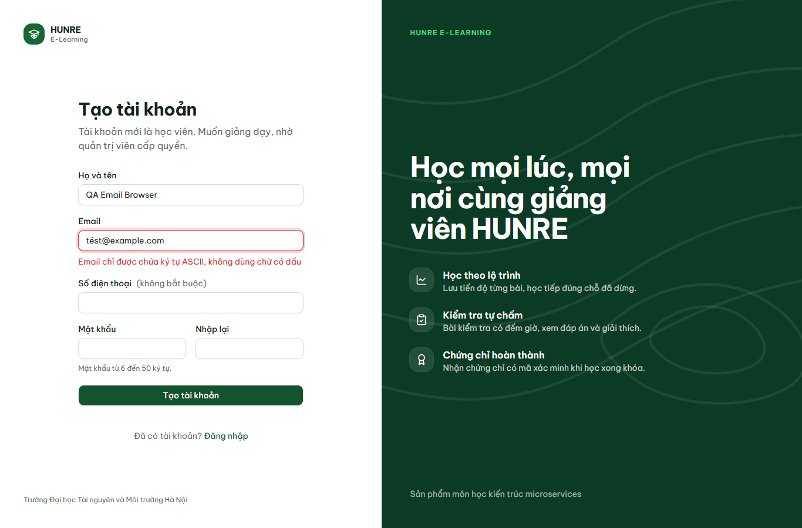
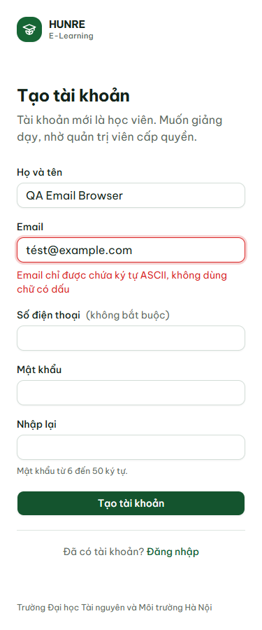

# Biên bản email so khớp chính xác — 08/10/2026

## Môi trường và mã nguồn

- Backend/migration/collection: `c937ee2` (V5 đã sửa thứ tự đổi collation trước UPDATE).
- Web production và script Edge: `69eaef1`; backend không đổi so với `c937ee2`.
- MySQL 8.0.43 riêng trên 13317, gateway 18080, auth 18081, course 18082, quiz 18084;
  web Next.js production 3100. API đều đi qua gateway; rate limit tắt riêng trong stack test.
- Không có Docker trên máy này. Docker được kiểm riêng bằng workflow CI của PR #82.
- Dữ liệu nằm trong database test cô lập, không dùng database dev/demo. Các process test
  đã dừng sau khi chạy; các schema thử migration đã được xóa bằng `finally`.

## API và migration thực tế

`newman@6.2.2`: **302 request, 746/746 assertion PASS**, không lỗi script.
Ba ca cần token hết hạn/tài khoản đã xóa cũng PASS: token được phát với TTL 1 giây rồi chờ
hết hạn thật, tài khoản đã xóa sau khi phát token; không giả lập response.
[Kết quả đầy đủ đã bỏ token/mật khẩu](auth-email/api-results.json).

| Ca | HTTP thực tế | Kết quả |
|---|---|---|
| AUTH-12.1 Đăng ký ASCII | 201 | PASS |
| AUTH-12.2 Đăng nhập email có dấu, đúng mật khẩu của email không dấu | 401 | PASS |
| AUTH-12.3 Đăng nhập chữ hoa | 200, đúng id | PASS |
| AUTH-12.4 Năm email Unicode: dấu ở tên, miền, dấu tổ hợp, fullwidth | 400 mỗi request; VALIDATION_FAILED, fieldErrors.email | PASS |
| AUTH-12.5 Đăng ký trùng bằng chữ hoa | 409 | PASS |
| AUTH-12.6 Admin tìm email có dấu | 200, danh sách rỗng | PASS |
| AUTH-12.7 Admin tìm chữ hoa và khoảng trắng hai đầu | 200, đúng tài khoản | PASS |

Migration được chạy bằng `python scripts/check-auth-email-migration.py` trên MySQL thật:

| Dữ liệu đầu vào | Kết quả thực tế |
|---|---|
| Database rỗng | PASS; email chuyển sang utf8mb4_bin |
| Email cũ viết hoa/thừa khoảng trắng; hai email khác dấu | PASS; chuẩn hóa đúng, giữ dấu/mật khẩu/id, không nhầm hai tài khoản |
| Hai email trùng sau chuẩn hóa | PASS; lỗi uk_normalized_email_collision trước mọi thay đổi; dữ liệu và collation cũ giữ nguyên |

[Kết quả migration](auth-email/migration-results.json). Ngoài script SQL, đã chạy auth-service
với Flyway target=4, tạo tài khoản, sửa email cũ thành chữ hoa có khoảng trắng, rồi khởi động
bản V5: Flyway success=1, Hibernate validate qua, email được chuẩn hóa, đăng nhập chữ hoa 200.

## Trình duyệt và kiểm tra hồi quy

**24/24 PASS** bằng Edge/Playwright, cùng 8 kiểm tra ở 1366/768/375px:

- Ba email Unicode (tên có dấu, miền có dấu, dấu tổ hợp): thông báo tiếng Việt dưới ô Email,
  aria-invalid=true, giữ email để sửa, vẫn ở /register.
- Email rỗng và sai định dạng: lỗi dưới ô Email.
- Điện thoại `abc` và mật khẩu ngắn: vẫn bị server chặn và hiện lỗi dưới đúng ô.
- Sửa email thành ASCII chữ hoa: đăng ký được, tự đăng nhập và tới /profile, email đã hạ chữ thường.
  Không tràn ngang, không lỗi JavaScript.

[Kết quả trình duyệt](auth-email/browser-results.json). Chạy lại:
`AUTH_PLAYWRIGHT_MODULE=<path-to-playwright/test> AUTH_WEB_URL=<web-url> node scripts/check-auth-email-browser.cjs`.
`AUTH_UI_OUTPUT` chọn thư mục lưu ảnh/kết quả. Script tạo tài khoản QA, chỉ dùng DB test.

- Maven `clean verify`: **910 tests, 0 failure/error/skipped**. Sau khi sửa SQL V5 đã package lại
  auth-service và chạy migration/collection thật như trên; phần Java không đổi.
- `pnpm next typegen`, `pnpm exec tsc --noEmit`, `pnpm lint`, `pnpm build`: PASS trên `69eaef1`.
- Kiểm migration đã merge và cấu hình security: PASS.

## Docker CI

[Workflow 37738610951](https://github.com/ariushieu/e-learning-microservices/actions/runs/37738610951)
trên `69eaef1`: **Full stack in Docker PASS**, gồm build/start toàn stack, smoke test,
collection auth qua gateway 8080 và bật lại rate limit sau khi test.

**299 request, 739/739 assertion PASS**, 0 lỗi script. AUTH-12 có đủ 11 request PASS với
cùng HTTP như bảng bên trên. Ba ca **BLOCKED** trên CI vì không cấp fixture riêng:
AUTH-03.8 (refresh token hết hạn thật), AUTH-05.5 (access token hết hạn thật), AUTH-07.10
(tài khoản đã xóa). Cả ba đã PASS trên stack MySQL cô lập ở phần API bên trên.

[Kết quả Docker đã bỏ dữ liệu nhạy cảm](auth-email/docker-results.json), lấy từ artifact
`auth-docker-acceptance` của workflow; collection khớp SHA-256 sau chuẩn hóa CRLF → LF.
Tất cả check của commit `69eaef1` xanh.
