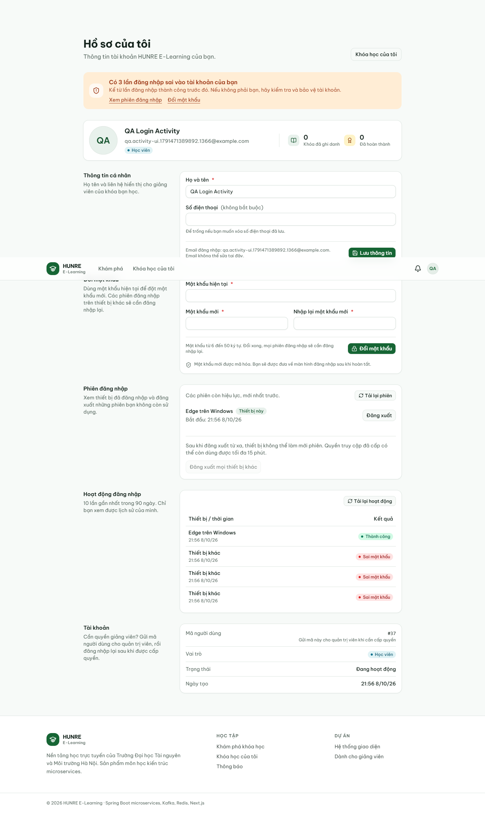
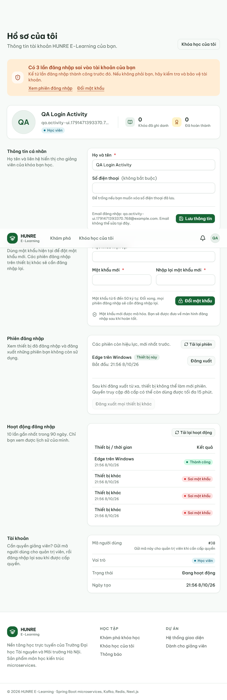
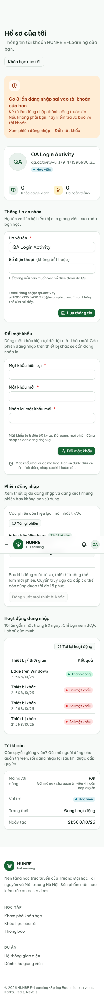

# Biên bản hoạt động đăng nhập — 08/10/2026

## Mã nguồn và môi trường

- Code ứng dụng/collection: `189fe07`; biên bản bổ sung bằng chứng sau khi kiểm.
- MySQL 8.0.43 riêng ở cổng 13317; gateway 18080, auth 18081, course 18082, quiz 18084.
  API luôn gọi qua gateway, xác thực bật, rate limit tạm tắt trên gateway QA riêng.
- Web production Next.js, cổng 3100; Edge/Playwright, 1366/768/375 px.
- Không dùng database dev/demo. Các tiến trình QA đã dừng; dữ liệu tạm ở `target/`
  (Git bỏ qua). Cấu hình rate limit trong repo không thay đổi.
- Máy không có Docker. Kết quả dưới đây là native MySQL thật; Docker được kiểm riêng
  bằng CI của PR, không gộp hay giả kết quả hai môi trường.

## Kết quả thật

**371 request, 923/923 assertion PASS**, không lỗi script hay ca BLOCKED.
[Kết quả từng request, mã HTTP và assertion](auth-login-events/api-results.json).
Ba fixture AUTH-03.8, AUTH-05.5, AUTH-07.10 dùng token phát thật TTL 1 giây rồi chờ hết
hạn, và tài khoản đã xóa sau khi phát token. Các phần AUTH-01–13 đều được chạy lại.

| Ca | HTTP thực tế / quan sát | Kết quả |
|---|---|---|
| AUTH-14.1 | Đăng ký 201; sai mật khẩu 401 ×3; login và me 200, count=3 | PASS |
| AUTH-14.2 | 200; 4 dòng đúng/sai/sai/sai, chỉ success/device/createdAt | PASS |
| AUTH-14.3 | 200 ×3; phân trang đúng, sort cố định, trang quá cuối rỗng | PASS |
| AUTH-14.4 | 400 ×5 với page/size/offset sai | PASS |
| AUTH-14.5 | 401 ×2 khi thiếu/sai token | PASS |
| AUTH-14.6 | 200; rotate hai lần đổi id, giữ startedAt/cảnh báo, lịch sử vẫn 4 dòng | PASS |
| AUTH-14.7 | Login/me 200; count=0 | PASS |
| AUTH-14.8 | Email không có: 401; không thêm dòng DB; GET lịch sử 200, vẫn 5 dòng | PASS |
| AUTH-14.9 | B đăng ký 201/login 200; userId=A vẫn chỉ trả 1 dòng của B (200) | PASS |
| AUTH-14.10 | Integration: UA 255 ký tự, xóa user thì cascade; fixture MySQL xóa user không lỗi FK | PASS |
| AUTH-14.11 | Integration: API ẩn dòng quá 90 ngày; MySQL: job xóa dòng cũ, giữ dòng mới | PASS |
| AUTH-14.12 | MySQL qua gateway: 8 request đồng thời đều 401; login/me 200, count=8, lịch sử 9 dòng | PASS |
| AUTH-14.13 | Flyway V4 → V6 có dữ liệu; Hibernate validate thành công; token cũ backfill đúng created_at | PASS |
| AUTH-14.14 | Edge ở ba độ rộng: cảnh báo, nhãn đỏ, link đúng, không tràn/không lỗi JS | PASS |
| AUTH-14.15 | 503 được chèn riêng để thử giao diện lỗi; thử lại 200 từ API thật, giữ dữ liệu cũ | PASS |
| AUTH-14.16 | Login tiếp hết cảnh báo; thêm hoạt động thì bảng chỉ 10 dòng mới nhất | PASS |

Bằng chứng: [migration và job retention](auth-login-events/migration-retention-results.json),
[8 lần sai đồng thời trên MySQL](auth-login-events/concurrency-results.json).
Job retention trong môi trường QA được đặt chạy mỗi 2 giây để kiểm thật; mặc định code
vẫn là 03:00 UTC hằng ngày. API tự lọc mốc 90 ngày trước khi job chạy.

## Build và kiểm thử tự động

- `mvnw -pl shared-common,api-gateway,auth-service,course-service,enrollment-service,quiz-service,notification-service clean verify`:
  **1.016 test, 0 failure/error/skipped**. Giữ `target/` của aggregator vì chứa công cụ QA.
- 7 test HTTP integration mới: transaction của 401, cửa sổ cảnh báo, bảo mật, phân trang,
  xoay token nhiều lần, UA/cascade, retention và 6 lần sai đồng thời.
- `pnpm exec next typegen`, `pnpm exec tsc --noEmit`, `pnpm lint`, `pnpm build`: PASS.
- `scripts/check-migrations.sh`, `scripts/check-security-config.sh`, `git diff --check`: PASS.
- Edge: **24/24 kiểm tra hoạt động đăng nhập**, **33/33 kiểm tra hồi quy phiên đăng nhập**.
  [24 kết quả](auth-login-events/activity-browser-results.json),
  [33 kết quả](auth-login-events/browser-results.json).

Lần chạy kịch bản phiên đầu tiên gặp race do xóa cookie thủ công trong lúc prefetch còn
đang chạy. Script giờ chờ network idle trước khi thao tác cookie; lần chạy đầy đủ sau đó
qua cả 33 ca. Tất cả API auth thành công đều gọi thật; chỉ chèn 503 để kiểm trạng thái lỗi.
Notification nằm ngoài stack native này nên request nền của nó được chặn bằng 503 trong
kịch bản trình duyệt. Không dùng dữ liệu auth thành công giả để lấy PASS.

## Chạy lại

```bash
docker compose --profile app up -d --build --wait
bash scripts/smoke-test.sh
RATE_LIMIT_ENABLED=false docker compose --profile app up -d --wait api-gateway
pnpm dlx newman@6.2.2 run docs/postman/auth.postman_collection.json
python scripts/check-auth-login-events-concurrency.py
# Khi không truyền 3 fixture đặc biệt: collection ghi BLOCKED đúng 3 ca cũ.
docker compose --profile app up -d --wait api-gateway
```

Hai script trình duyệt dùng Playwright có Edge và web production đang chạy:
`check-auth-login-events-browser.cjs`, `check-auth-sessions-browser.cjs` trong `scripts/`.
Có thể truyền `AUTH_PLAYWRIGHT_MODULE`, `AUTH_WEB_URL`, `AUTH_GATEWAY_URL`, `AUTH_UI_OUTPUT`;
mặc định web 3000, gateway 8080. Chỉ chạy trên DB QA vì có tạo tài khoản test.

## Ảnh giao diện đã kiểm




