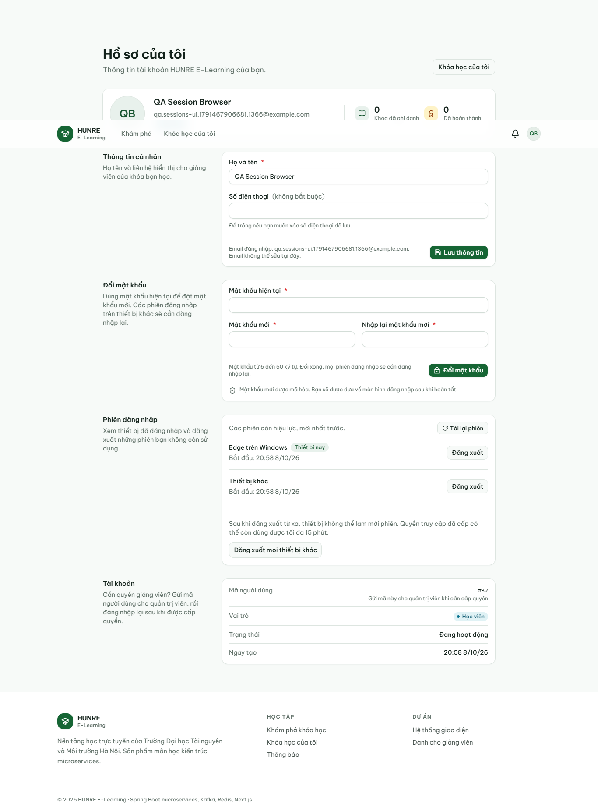
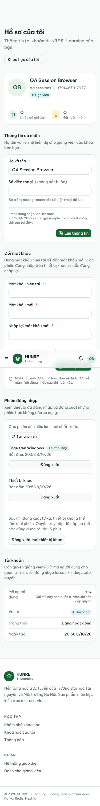

# Biên bản quản lý phiên đăng nhập — 08/10/2026

## Mã nguồn và môi trường

- Code ứng dụng và collection: `cfed738`. Commit biên bản chỉ sửa script điều hướng test
  và thêm bằng chứng, không thay đổi code ứng dụng.
- Native: MySQL 8.0.43 cô lập ở 13317, gateway 18080, auth 18081, course 18082, quiz 18084;
  Next.js production 3100, Edge qua Playwright. Mọi request API đi qua gateway.
- Máy không có Docker; kiểm Docker bằng CI thật của PR #88, gateway 8080.
- Database test riêng, không dùng DB dev/demo của người dùng. Các tiến trình test đã dừng.
  File dữ liệu tạm nằm trong `target/sessions-acceptance/`, được Git bỏ qua.

## Kết quả API thật

Native: **341 request, 846/846 assertion PASS**, không lỗi script, không có ca BLOCKED.
Ba fixture AUTH-03.8/AUTH-05.5/AUTH-07.10 là token phát thật với TTL 1 giây rồi chờ hết hạn,
và tài khoản được xóa sau khi phát token. [Kết quả đã bỏ token/mật khẩu](auth-sessions/api-results.json).

Docker: **338 request, 839/839 assertion PASS**, không lỗi script. Toàn bộ 39 request mới
AUTH-13 PASS. Ba ca cũ BLOCKED vì CI không tạo fixture riêng: AUTH-03.8 (refresh hết hạn),
AUTH-05.5 (access hết hạn), AUTH-07.10 (user đã xóa). Cả ba đã PASS trên native như trên.

[Workflow 37787231236](https://github.com/ariushieu/e-learning-microservices/actions/runs/37787231236)
trên `cfed738`: toàn stack Docker, smoke test, auth collection và kiểm enrollment hiện có
đều PASS; CI bật lại rate limit khi xong. [Artifact auth đã làm sạch](auth-sessions/docker-results.json).
SHA-256 collection đã đối chiếu đúng sau chuẩn hóa CRLF → LF.

| Ca | HTTP thực tế | Kết quả |
|---|---|---|
| AUTH-13.1 Register trim email trước validation | 201 (2 request) | PASS |
| AUTH-13.2 Login có khoảng trắng, Edge/Postman/B | 200 (3 request) | PASS |
| AUTH-13.3 Danh sách của Edge, thứ tự, đúng 4 trường, không dữ liệu nhạy cảm | 200 | PASS |
| AUTH-13.4 Current theo token Postman | 200 | PASS |
| AUTH-13.5 Lấy phiên B; xóa phiên B/id không tồn tại | 200; 404; 404 | PASS |
| AUTH-13.6 Xóa Postman và thử refresh | 200; 401 | PASS |
| AUTH-13.7 JWT của phiên đã thu hồi vẫn gọi /me được | 200 | PASS |
| AUTH-13.8 Phiên thu hồi biến mất; xóa lại id | 200; 404 | PASS |
| AUTH-13.9 Refresh đổi sid, giữ device/current | 200; 200 | PASS |
| AUTH-13.10 Sid đã rotate gọi revoke-others | 401 | PASS |
| AUTH-13.11 Tạo 2 phiên, revoke-others, xem lại, refresh 2 phiên cũ | 200; 200; 200; 200; 401; 401 | PASS |
| AUTH-13.12 Phiên B không bị ảnh hưởng | 200 | PASS |
| AUTH-13.13 Revoke-others lần nữa | 200 | PASS |
| AUTH-13.14 Current vẫn refresh được | 200 | PASS |
| AUTH-13.15 Lấy id, xóa current, refresh lại | 200; 200; 401 | PASS |
| AUTH-13.16 Danh sách hết phiên | 200, [] | PASS |
| AUTH-13.17 Thiếu token/token sai ở cả 3 endpoint | 401 (6 request) | PASS |
| AUTH-13.18 Email trắng ở register/login | 400 VALIDATION_FAILED (2 request) | PASS |

## Java và kiểm tra build

`mvnw -pl shared-common,api-gateway,auth-service,course-service,enrollment-service,quiz-service,notification-service clean verify`:
**993 tests, 0 failure/error/skipped**. Chạy sạch cả 7 module; không clean target của
aggregator vì chứa công cụ và dữ liệu QA cô lập.

Test mới kiểm sid khớp đúng refresh token lưu DB, rotation, expiry/revocation filtering,
ownership/404, JWT còn hạn sau revoke, legacy token thiếu sid, sid không tồn tại/thuộc
người khác/đã rotate, revoke-others đồng thời refresh, User-Agent dài và các trình duyệt/OS.
Kiểm trim đi qua HTTP/Jackson 3 thật, không chỉ gọi setter trong unit test.

Frontend `pnpm next typegen`, `pnpm exec tsc --noEmit`, `pnpm lint`, `pnpm build`: PASS.
Kiểm migration đã merge và cấu hình security: PASS. Không có migration/shared-common thay đổi.

## Kiểm tra Edge

**33/33 PASS**, 11 kiểm tra ở mỗi bề ngang 1366, 768, 375px.
[Kết quả chi tiết](auth-sessions/browser-results.json).

1. Edge và Postman có hai phiên; phiên Edge hiện đúng “Edge trên Windows”/“Thiết bị này”.
2. Thao tác nhìn thấy được trên mobile, không tràn ngang.
3. Hủy xác nhận không thu hồi phiên.
4. DELETE lỗi 503: hộp thoại giữ mở, hiện lỗi, cho thử lại.
5. Thử lại gọi backend thật: refresh token Postman nhận 401.
6. Revoke-others giữ current và chặn refresh của cả hai phiên khác.
7. Lưu hồ sơ → server action refresh: sid đổi, UA/current còn đúng.
8. Proxy refresh vẫn giữ User-Agent trình duyệt.
9. BFF refresh vẫn giữ User-Agent trình duyệt.
10. BFF retry sau JWT sai chữ ký vẫn giữ User-Agent trình duyệt.
11. Đăng xuất current: cookie access/refresh bị xóa, về trang login; mở /profile ở tab mới
    về /login?next=/profile; không lỗi JavaScript.

Phạm vi: API auth gọi gateway/MySQL thật. Chỉ giả lập một DELETE 503 để kiểm lỗi/thử lại.
Stack native không có notification-service; yêu cầu thông báo trả 503 ngay ở browser test
để chúng không tranh refresh khi script cố ý xóa/làm sai access cookie. Không dùng response
giả cho danh sách, đăng nhập, refresh hoặc thu hồi thành công. Toàn stack Docker đã kiểm riêng.

Chạy lại: `AUTH_PLAYWRIGHT_MODULE=<path-to-playwright/test> AUTH_WEB_URL=<web-url> AUTH_GATEWAY_URL=<gateway-url> node scripts/check-auth-sessions-browser.cjs`.
`AUTH_UI_OUTPUT` chọn thư mục lưu ảnh/kết quả. Script tạo tài khoản QA; chỉ dùng DB test.

