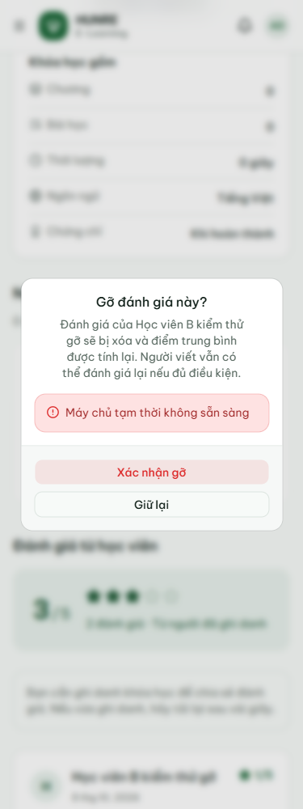
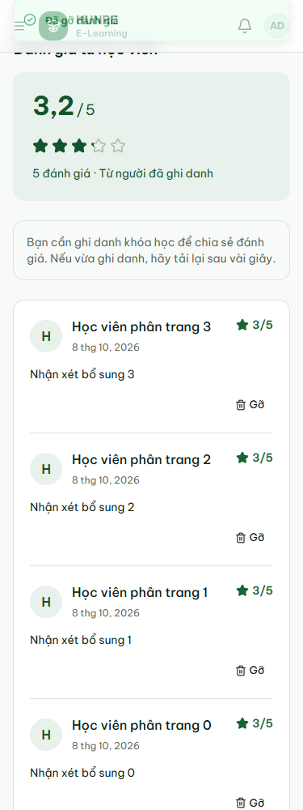
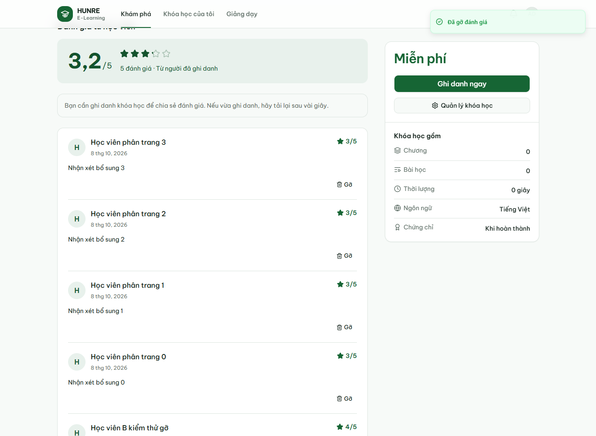

# Biên bản admin gỡ đánh giá khóa học

Ngày 08/10/2026 (UTC+7), mã nguồn `ca5663dd46588c5c8291eaef5646ea014b4a0d9c`.

## Môi trường và kết quả

- Windows; MySQL 8 và Kafka 4.2.1 cài trên máy; backend chạy JAR, JWT bật.
- Request qua gateway `http://localhost:8080`, frontend production `http://127.0.0.1:3000`.
- Rate limit tắt trong phiên QA; auth dùng database dev đã khởi tạo, tắt Flyway khi chạy local.
- Máy không có Docker: **chưa chạy collection này trên Docker**. CI smoke Docker là kiểm tra
  riêng, không thay cho toàn bộ collection.
- Maven `clean verify` cả 7 module: **875 test, 0 lỗi, 0 bỏ qua**.
- Frontend: Next typegen, TypeScript, ESLint và production build đạt.
- Newman 6.2.2: **938 HTTP request, 879/879 assertion đạt**, không lỗi script;
  250 ca theo bảng và 16 ca bổ sung. [Biên bản API](course.md), [JSON](course-evidence.json).
- Edge headless / Playwright: **15/15 kiểm tra đạt**, không lỗi JavaScript.
  [Kết quả trình duyệt](course-moderation/moderation-ui-results.json).
- Generator sinh lại collection giống hệt bản đã commit (chuẩn hóa CRLF/LF).

Sau khi đồng bộ `main` mới `7a3cc03` (quiz xuất CSV), commit gộp `f34f877`:
frontend typegen/TypeScript/lint/production build và chạy lại **15/15** ca trình duyệt đều đạt.
[Kết quả sau đồng bộ](course-moderation/after-merge-ui-results.json).
API course/backend không đổi so với commit kiểm thử ở trên; số liệu Newman và Maven
ở trên thuộc lần chạy `ca5663d`, không gán lại cho commit gộp.

## Phạm vi kiểm tra

1. Không token 401; học viên, người viết, giảng viên chủ khóa 403. Token sửa vai trò nhưng
   giữ chữ ký cũ bị từ chối 401 trong kiểm thử controller/JWT.
2. Admin chưa ghi danh vẫn gỡ được; khóa không tồn tại, review không tồn tại hoặc review
   thuộc khóa khác trả 404, không thay đổi dữ liệu; reviewId không phải số trả 400.
3. S 5 sao + B 1 sao thành 3/2. Admin gỡ B thành 5/1; gỡ lại 404;
   B vẫn được viết lại thành bản ghi mới. Gỡ hết đánh giá đặt điểm/số lượt về 0.
4. Gỡ hoạt động cả khi khóa chuyển DRAFT, PENDING_REVIEW hoặc ARCHIVED (controller tests);
   DRAFT/ARCHIVED có thêm ca thật qua gateway trên MySQL.
5. H2 kiểm 12 học viên với admin gỡ 6 nhận xét đồng thời 6 người còn lại sửa điểm;
   kết quả đúng 3/6. Admin và người viết cùng xóa một nhận xét: một thành công, một 404.
6. MySQL/gateway kiểm gỡ B đồng thời S sửa 5 thành 4: còn đúng một đánh giá 4 sao.
7. Trình duyệt: khách/S/B/chủ khóa không có nút Gỡ; admin thấy trên từng nhận xét.
   Hủy xác nhận giữ nguyên dữ liệu. Giả lập response 503 ở trình duyệt giữ hộp thoại,
   hiện lỗi và cho thử lại; lần thử lại thành công cập nhật danh sách/điểm ngay.
8. B viết lại bằng form sau khi bị gỡ. Gỡ nhận xét cuối trang 2 trở về trang đầu;
   số nhận xét và tổng điểm khớp API. Không tràn ngang ở 375/768/1366px.

## Bằng chứng giao diện







## Chạy lại

Chuẩn bị tài khoản QA theo collection; chạy backend/gateway và frontend production.
Playwright lấy module từ `COURSE_PLAYWRIGHT_MODULE` nếu không có trong node_modules;
đặt `COURSE_BROWSER_CHANNEL=msedge` để dùng Edge, `COURSE_UI_OUTPUT` để chọn thư mục kết quả.

```bash
node scripts/check-course-moderation.cjs
pnpm dlx newman@6.2.2 run docs/postman/course.postman_collection.json --timeout-script 65000 --timeout-request 10000 --reporters cli,json --reporter-json-export /tmp/course-newman.json
node scripts/report-course-postman.cjs /tmp/course-newman.json
```

Chạy lần lượt vì các ca dùng chung tài khoản QA. Browser test tạo khóa/nhận xét riêng,
xóa các nhận xét của fixture rồi lưu trữ khóa khi kết thúc. Collection giữ dữ liệu demo.
Không commit báo cáo Newman gốc vì có token; JSON bằng chứng chỉ chứa response nghiệp vụ.
