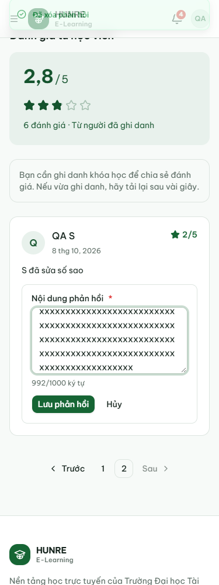
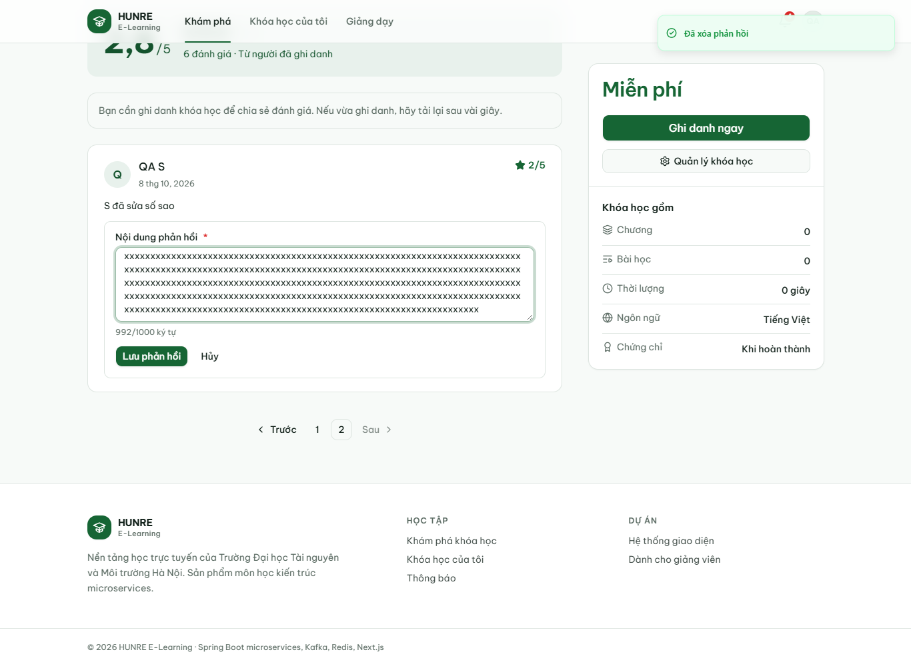
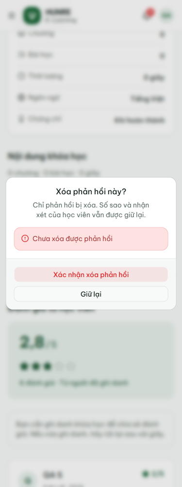
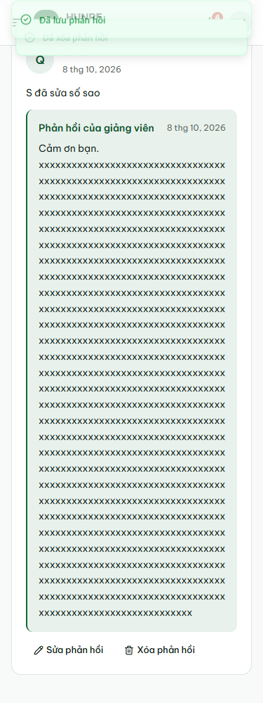

# Biên bản giảng viên trả lời đánh giá

Ngày 08/10/2026 (UTC+7), commit nguồn `696ee6c9444bea93bac9cdb294372bfb67df03c4`,
đã đồng bộ main `371b613` trước khi làm.

## Môi trường và kết quả

- Windows, Java 21 (release 17), MySQL 8 và Kafka 4.2.1 cài trực tiếp; backend JAR,
  frontend production. Request qua gateway `http://localhost:8080`, web `http://127.0.0.1:3000`.
- JWT bật; tắt rate limit trong phiên QA rồi bật lại. Auth dùng DB dev đã khởi tạo, tắt Flyway local.
- Máy không có Docker: không ghi nhận đã chạy collection trong Docker. CI Docker smoke/schema
  là kiểm tra riêng, không thay cho lần chạy toàn bộ collection trên Docker.
- Migration V6 áp dụng thành công trên `course_db` có dữ liệu từ V5; service khởi động với
  `ddl-auto=validate`. [Log Flyway đã lọc](course-replies/migration.txt).
- Maven clean verify 7 module: **920 test, 0 lỗi, 0 bỏ qua**. Course review controller 44 test,
  concurrency 7 test, gồm 19 lần thực thi mới cho phản hồi.
- Frontend typegen, TypeScript, ESLint, production build đạt.
- Newman 6.2.2: **1042 HTTP request, 973/973 assertion đạt**, không lỗi script;
  **279 ca theo bảng + 16 ca bổ sung**. [Biên bản API](course.md), [JSON bằng chứng](course-evidence.json).
- Playwright/Edge headless: **20/20 kiểm tra đạt**, không lỗi JavaScript;
  [kết quả](course-replies/reply-ui-results.json). Đã chạy lại sau khi giới hạn chiều cao ô nhập.
- Generator sinh lại collection giống bản commit khi chuẩn hóa CRLF/LF.

## Những tình huống đã đối chiếu

1. A có vai trò giảng viên và sở hữu khóa được trả lời/sửa/xóa; admin không cần ghi danh.
   S, giảng viên B bị 403; thiếu/sai token 401; đúng ID chủ khóa nhưng thiếu vai trò giảng viên
   vẫn 403. Đánh giá không thuộc khóa hoặc ID không tồn tại 404.
2. Nội dung null/thiếu/rỗng/chỉ khoảng trắng và 1001 ký tự trả 400 `VALIDATION_FAILED` theo
   ô `content`, không ghi đè phản hồi cũ. Một ký tự và 1000 ký tự được chấp nhận.
3. `replied_by` lấy từ JWT, không nhận giá trị giả trong body, không trả ID này cho khách.
   Nội dung/thời gian response PUT khớp GET trên MySQL (độ chính xác micro giây).
4. S sửa sao/nhận xét vẫn giữ phản hồi và thời gian. Body đánh giá tự chèn `reply` không có tác dụng.
   S tự xóa hoặc admin gỡ đánh giá thì phản hồi mất theo; viết lại không mang phản hồi cũ.
5. H2: sáu lần trả lời chạy đồng thời sáu lần sửa cùng đánh giá, vẫn giữ cả hai dữ liệu.
   Trả lời đua với xóa đánh giá không làm sống lại bản ghi đã xóa. MySQL/gateway có thêm ca
   trả lời đồng thời sửa sao, đối chiếu đúng phản hồi và tổng điểm.
6. Khóa DRAFT/PENDING_REVIEW/ARCHIVED vẫn cho người quản lý trả lời; khách không thấy đánh giá
   của khóa riêng tư. Học viên cũ đọc được phản hồi khóa ARCHIVED.
7. Web chỉ hiện nút quản lý cho A/admin; khách thấy nhãn **Phản hồi của giảng viên** và nội dung.
   Lưu/sửa/xóa cập nhật ngay, giữ trang đánh giá số 2. Admin cũng sửa được trên giao diện.
8. HTML hiện nguyên văn, không tạo thẻ ảnh/chạy mã. API 503 và lỗi theo ô 400 được giả lập tại
   trình duyệt để kiểm giao diện: giữ bản nháp, báo lỗi đúng ô; lỗi xóa giữ hộp xác nhận.
   Hủy xác nhận không xóa. Xóa thành công chỉ xóa phản hồi, giữ số sao/nhận xét.
9. Kiểm tra 375/768/1366px không tràn ngang; ô nhập dài có cuộn trong, không giãn vô hạn.
   Phản hồi gần 1000 ký tự với từ dài vẫn xuống dòng trên điện thoại.

## Bằng chứng giao diện









## Chạy lại

Chuẩn bị tài khoản QA như collection. Dùng frontend production và backend đã chạy V6.
Đặt `COURSE_PLAYWRIGHT_MODULE` nếu Playwright không có trong node_modules,
`COURSE_BROWSER_CHANNEL=msedge` để dùng Edge, `COURSE_UI_OUTPUT` để chọn thư mục bằng chứng.

```bash
node scripts/check-course-replies.cjs
pnpm dlx newman@6.2.2 run docs/postman/course.postman_collection.json --timeout-script 65000 --timeout-request 10000 --reporters cli,json --reporter-json-export /tmp/course-newman.json
node scripts/report-course-postman.cjs /tmp/course-newman.json
```

Chạy lần lượt vì dùng chung tài khoản QA. Browser script chỉ thao tác fixture riêng, xóa nhận xét
và lưu trữ khóa thử khi xong. Collection giữ dữ liệu demo. Báo cáo Newman gốc chứa token nên chỉ
giữ trong target; bằng chứng đã xuất không có token hoặc mật khẩu.
