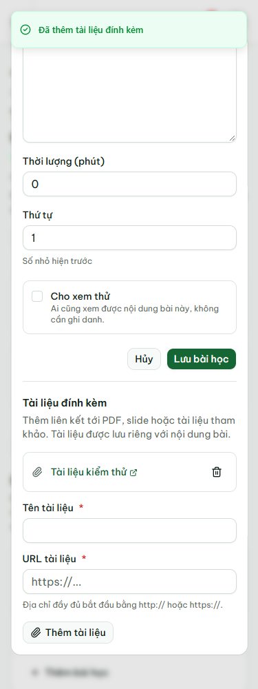
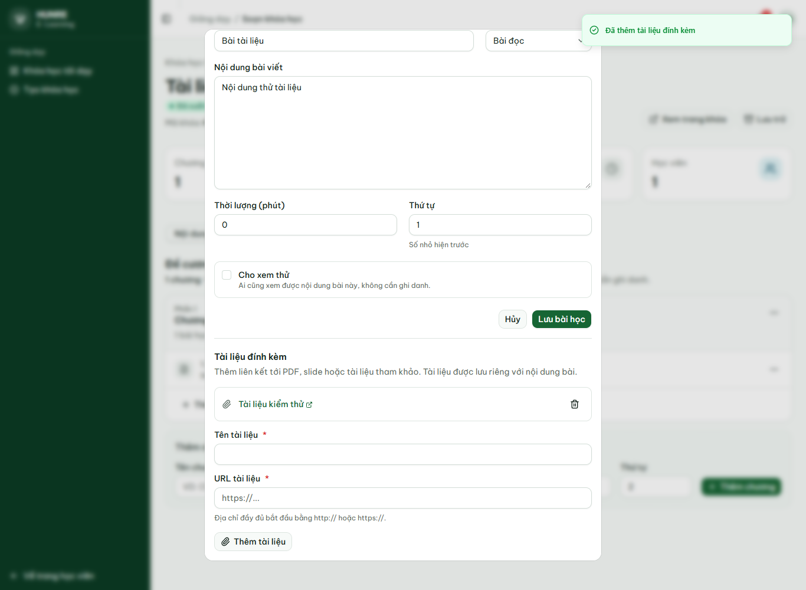
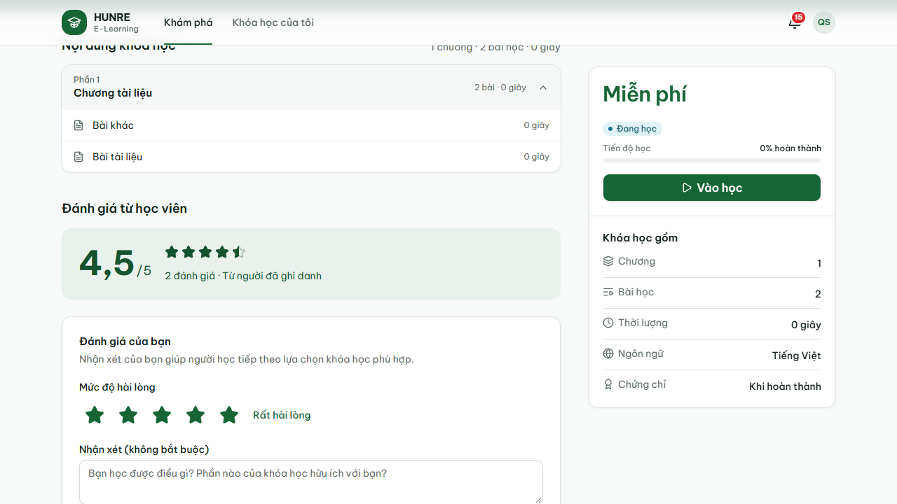

# Biên bản tài liệu bài học và sao đánh giá

Ngày 08/10/2026 (UTC+7). Mã nguồn kiểm thử: `83e51b82f49612148db0909f11dd15b4d3386285`.

## Môi trường và kết quả

- Windows, MySQL 8 và Kafka cài trên máy; các service chạy JAR, frontend build production.
- API đi qua gateway `http://localhost:8080`, frontend `http://127.0.0.1:3000`.
- JWT bật; tạm tắt rate limit cho tài khoản QA trong lúc chạy, bật lại sau kiểm thử.
- Máy không có Docker, do đó đây không phải bằng chứng chạy Docker/Redis.
- Maven verify cả 7 module: **796 test, 0 lỗi, 0 bỏ qua**, gồm 21 ca URL mới.
- Frontend: Next typegen, TypeScript, ESLint và production build đạt.
- Newman: **880 HTTP request, 827/827 assertion**, không lỗi script; 233 ca theo bảng
  và 16 ca bổ sung. Xem [biên bản API](course.md) và [bằng chứng JSON](course-evidence.json).
- Giao diện tài liệu: **16/16**, [kết quả](course-resources/resource-ui-results.json).
- Hồi quy đánh giá: **16/16**, [kết quả](course-resources/review-regression-results.json).
- Sinh lại collection từ generator cho kết quả giống hệt file đã commit.

## Các luồng đã kiểm tra

1. Thêm tài liệu ngay trong form sửa bài, không gửi hoặc thay đổi form bài học.
2. URL `javascript:alert(1)` trả 400, lỗi hiện dưới ô URL và giữ dữ liệu đang nhập.
3. HTTPS hợp lệ được lưu; học viên đã ghi danh thấy tài liệu trên trang học, mở đúng URL
   trong tab mới. Test chặn request tới website ngoài bằng nội dung giả lập để không phụ thuộc
   website ngoài; đường dẫn mở vẫn phải khớp URL đã lưu.
4. Không token trả 401; học viên hoặc giảng viên khác thêm/xóa trả 403; sai lessonId khi xóa
   trả 404. Người chưa ghi danh không đọc được tài liệu của bài thường.
5. Hủy xác nhận xóa không thay đổi dữ liệu. Xóa thành công thì màn quản lý và trang học đều
   không còn tài liệu. Lỗi 503 giữ hộp xác nhận để thử lại.
6. Lỗi 503 khi thêm giữ nguyên tên/URL. Form và danh sách không tràn ngang ở 375/768/1366px.
7. Hai người đánh giá 5 và 4 tạo trung bình thật 4,5. Bốn sao tô đầy, sao cuối tô 50%.
8. Hồi quy gửi/sửa/xóa đánh giá, phân trang, quyền ghi, nội dung HTML hiển thị dạng văn bản,
   tổng điểm trên thẻ khóa, xử lý lỗi API và ba kích thước màn hình. Không có lỗi JavaScript.

## Bằng chứng giao diện







## Chạy lại

Chuẩn bị tài khoản QA như collection, chạy các service và frontend production. Cài Playwright
trong môi trường kiểm thử; đặt `COURSE_PLAYWRIGHT_MODULE` tới module nếu không có trong node_modules.
`COURSE_BROWSER_CHANNEL=msedge` dùng Edge cài trên máy. Thư mục ảnh/báo cáo cấu hình qua
`COURSE_UI_OUTPUT`; mặc định nằm trong thư mục tạm.

```bash
node scripts/check-course-resources.cjs
node scripts/check-course-reviews.cjs
pnpm dlx newman@6.2.2 run docs/postman/course.postman_collection.json --timeout-script 65000 --timeout-request 10000
```

Chạy lần lượt, không chạy đồng thời vì dùng chung tài khoản QA. Fixture có tên riêng theo thời
gian; khóa thử giao diện được lưu trữ khi kết thúc, không xóa dữ liệu của người khác.
Báo cáo Newman gốc chứa token nên chỉ giữ trong `target/`, không commit. JSON bằng chứng và ảnh
ở đây không chứa token hoặc mật khẩu.
