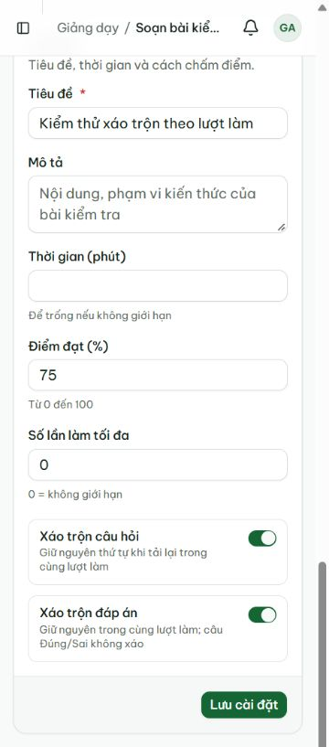
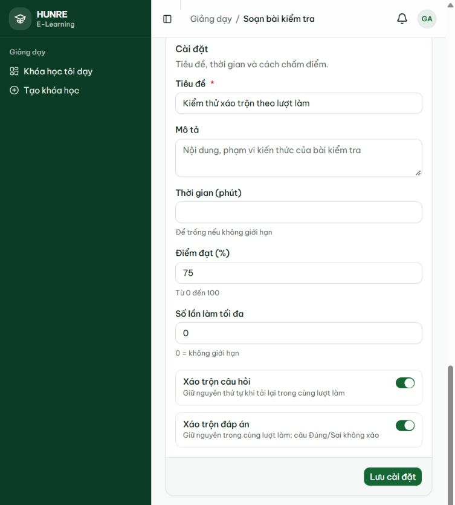
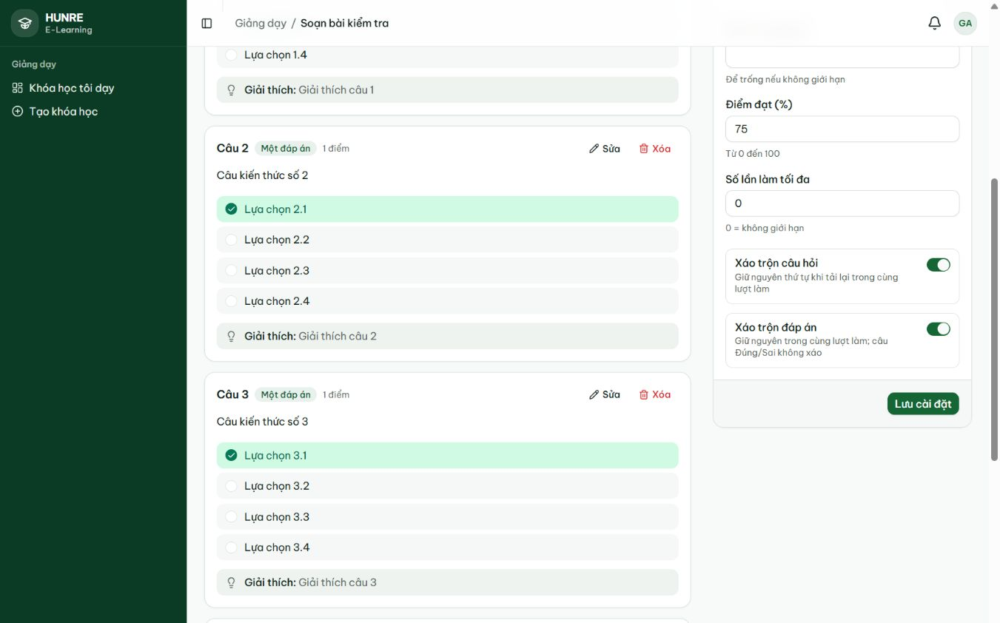
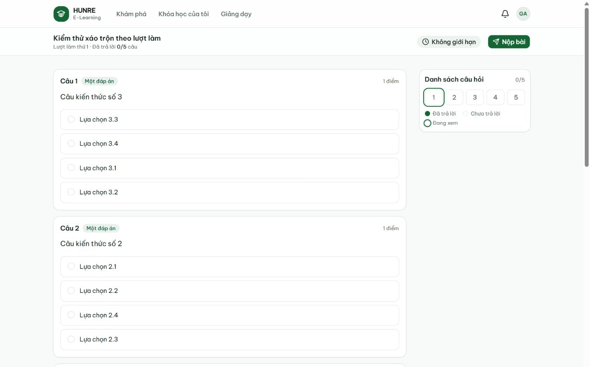
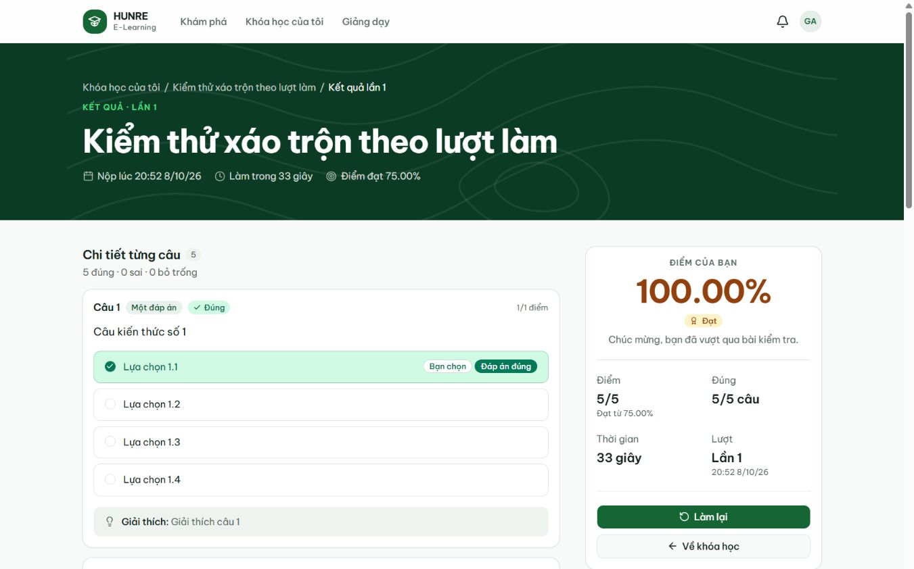

# Biên bản QUIZ-20 — xáo trộn theo lượt làm

Ngày 08/10/2026. Nhánh `quiz-service`, đồng bộ `main` tới `53bb8f6` (#85).
Kiểm phần code trong cùng commit với biên bản này, trước khi commit/push.

Trước khi mở PR, `main` có thêm #87 (`8050d85`): đã gộp vào `quiz-service` và chạy
lại toàn bộ Maven `verify`: **984 test, 0 failure/error/skip**, BUILD SUCCESS, 4 phút
07 giây. Frontend typegen, tsc, lint và production build trên bản gộp cũng PASS.
Kết quả API/UI MySQL dưới đây được ghi trước lần gộp này; #87 không đổi code quiz.

## Môi trường

- Java 17; MySQL Community 8.0.46 cài trực tiếp trên Windows, instance QA riêng cổng 13306.
  Auth/course/enrollment/quiz chạy thật, Flyway bật, Hibernate validate; gateway 8080
  xác thực JWT. Tài khoản QA đăng nhập qua auth API thật.
- Kafka listener/outbox worker và rate limit tắt bằng tham số tiến trình kiểm thử.
  Nạp course snapshot cho các khóa QA thay phần đồng bộ Kafka. Bảy request Kafka thủ công
  của collection bỏ qua, không tính là PASS.
- Frontend production build, `next start` cổng 3001; thao tác bằng Codex in-app browser.
- Máy không có Docker. Kiểm API bên dưới dùng MySQL thật, không dùng H2; chưa chạy lại
  toàn bộ Docker/Kafka/Redis tại máy này. Integration tự động dùng H2, ghi riêng bên dưới.

## Kết quả

| Kiểm tra | Kết quả |
|---|---|
| Toàn bộ Maven `verify` cuối | **980 test**, 0 failure/error/skip; BUILD SUCCESS, 3 phút 50 giây |
| `QuizShuffleIntegrationTest` | **12/12**, JWT security bật, gồm tổ hợp cờ độc lập và position trùng |
| Frontend typegen, tsc, lint, production build | PASS |
| Collection qua gateway/MySQL | **291 request, 618/618 assertions**, 0 lỗi script; 2 phút 17.3 giây |
| Nhóm QUIZ-20 | **28 request**, gồm chuẩn bị đề, 5 lần lấy đề, nộp và lượt mới; PASS |
| QUIZ-13.7 và QUIZ-14.8 hồi quy | Chờ 100 giây nộp quá giờ → 422; lượt đang làm không lấy được đáp án → 422 |
| Migration V4 → V5 trên MySQL | Giữ **32/32** đề cũ; cả 32 có `shuffle_options = false`; Flyway thành công |
| Luồng giao diện | **15/15 PASS**, [ui-checks.json](quiz-shuffle/ui-checks.json) |
| Quy ước | Cấu hình bảo mật, migration đã merge và diff đều PASS |

Lượt `clean verify` trước đó đạt 979 test; sau khi bổ sung ca position trùng, chạy lại
toàn bộ `verify` đạt 980 test như trên. Không có test bị bỏ qua trong Maven.

Collection chạy với `runSlowTests=true`, thời hạn script 150000 ms (lớn hơn thời gian
chờ 100000 ms). Ví dụ với environment QA đã cấu hình:
`newman run docs/postman/quiz.postman_collection.json -e qa.environment.json --env-var runSlowTests=true --timeout-script 150000`.
[api-checks.json](quiz-shuffle/api-checks.json) chỉ giữ tên ca, HTTP status, assertion;
không chứa token/cookie. [migration.txt](quiz-shuffle/migration.txt) ghi kết quả nâng schema thật.

## Những điểm đã xác minh

- Với đề 5 câu bật hai cờ, 5 lần `/take` của S trả đúng cùng thứ tự câu và đáp án.
  Resume trả cùng id lượt. Query giả `userId`/`attemptId` không đổi seed: lấy danh tính từ JWT.
  Người chưa có lượt không mượn seed người khác, không tự tạo lượt, nhận thứ tự gốc.
- `shuffleQuestions` và `shuffleOptions` độc lập. Lượt SUBMITTED/EXPIRED không được dùng
  làm seed. Khách 401, đề DRAFT 422; đáp án đúng không xuất hiện trong `/take`.
- Đúng/Sai giữ thứ tự đã soạn; các câu khác xáo trên bản sao DTO, không ghi position vào DB.
  Position trùng được phân định bằng id để đầu vào thuật toán vẫn ổn định.
- Chấm bằng id đáp án vẫn đạt 100%. Trang kết quả, tác giả, thống kê và CSV giữ thứ tự gốc;
  kết quả không bị đổi sau các lần tải đề. Tắt hai cờ phục hồi cả thứ tự câu lẫn lựa chọn.
- Web lấy đề sau khi bắt đầu/resume, nên ngay lần hiển thị đầu đã dùng seed đúng. Thử
  tải lại rồi làm tiếp 3 lần: mọi nội dung thẻ câu hỏi/lựa chọn giống hệt lần đầu.
  Lượt đầu có thứ tự nội dung 3–2–1–4–5, đạt 100% (5/5); lượt mới 1–5–3–2–4 và cũng
  ổn định sau tải lại. Trang kết quả và soạn đề đều 1–2–3–4–5.
- Hai switch lưu được và đọc lại đúng. Trang cài đặt ở 375/768/1366px không tràn ngang.
  Lượt đọc log cuối không có console error.

Seed mới không bảo đảm mọi hoán vị luôn khác nhau với tập câu nhỏ; fixture 5 câu ở lượt
kiểm trên đã khác. Tính ổn định áp dụng khi nội dung/cài đặt đề không đổi: đây không phải
snapshot đề tại thời điểm bắt đầu, sửa câu/cài đặt giữa lượt có thể đổi thứ tự.

## Ảnh kiểm chứng

